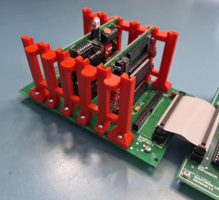
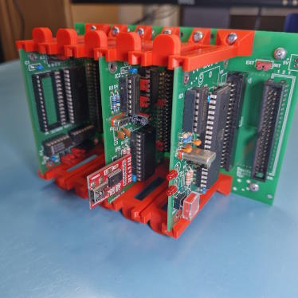

## SC-BP Six Slot Backplane 

The Backplane board allows the expansion of the Southern Cross SBC, the 40 way Box header on the main board brings out all of the Z80 pins.

You can also use the backplane with the processor board, a expansion memory board and a serial port board to create a stand-alone system.

Included in this folder is the .STL file for the card guide.